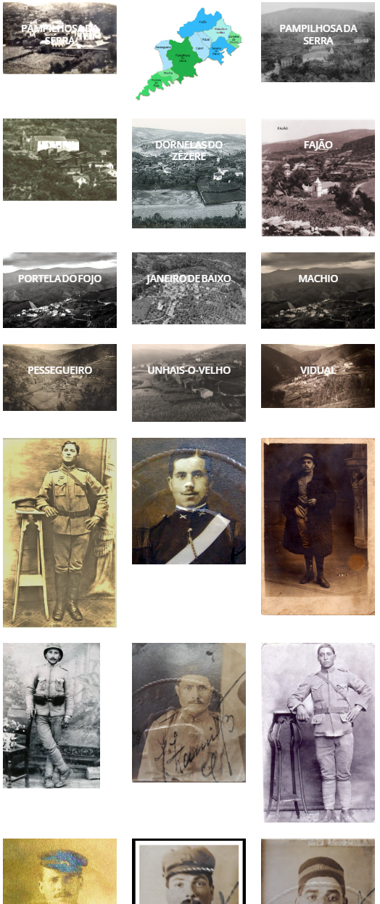

<h1 align="center">
  <a href="https://github.com/jtmb">
    
  </a>
</h1>

<div align="center">
  <b>APLB</b> - In memory of Ana Paula Branco. A personal site and memoir of her work.
  <br />
  <br />
  <a href="https://github.com/jtmb/aplb/issues/new?assignees=&labels=bug&title=bug%3A+">Report a Bug</a>
  ·
  <a href="https://github.com/jtmb/aplb/issues/new?assignees=&labels=enhancement&template=02_FEATURE_REQUEST.md&title=feat%3A+">Request a Feature</a>
  .
  <a href="https://hub.docker.com/repository/docker/jtmb92/aplb/general">Docker Hub</a>
</div>
<br>
<details open="open">
<summary>Table of Contents</summary>

- [About](#about)
- [Prerequisites](#prerequisites)
- [Getting Started](#getting-started)
    - [Docker Image](#docker-image)
    - [Running on Docker Compose](#running-on-docker-compose)
- [License](#license)

</details>
<br>

---

### <h1>About </h1>

In memory of Ana Paula Branco. A personal site and memoir of her work.. This is a self hosted project meant to my cousins work.

---




### <h2>Getting Started</h2>
### [Docker Image](https://hub.docker.com/r/jtmb92/aplb)
```docker
 docker pull jtmb92/aplb
```
### Running on Docker Compose  
Run on Docker Compose (this is the recommended way) by running the command "docker compose up -d".  
```yaml
---
services:
  aplb:
    image: jtmb92/aplb:latest
    ports:
      - "8080:80"
```
## License

This project is licensed under the **GNU GENERAL PUBLIC LICENSE v3**. Feel free to edit and distribute this template as you like.

See [LICENSE](LICENSE) for more information.